# Transformer
> 使用 pytorch 实现 Transformer 翻译模型，并且在机器翻译任务上进行训练、推理。并且会进行注意力分数的可视化。
> github 地址：[Transformer](https://github.com/hkproj/pytorch-transformer/blob/main/train.py)
> 理论部分：[Attention is all you need](https://ktv422gwig.feishu.cn/wiki/COSEwUT8CiJ7YvkCckHcVxREnfc)

## 模型结构图
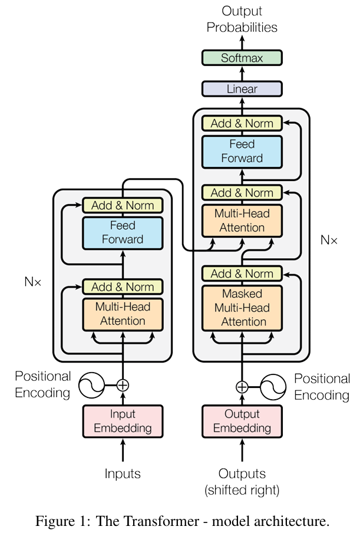

## 网络结构
### 1. embedding
> 嵌入层，将输入的单词的<font color='red'>词表索引</font>映射为对应的词向量表示（在 transformer 中，词向量是输入的输入特征，维度为 512）。

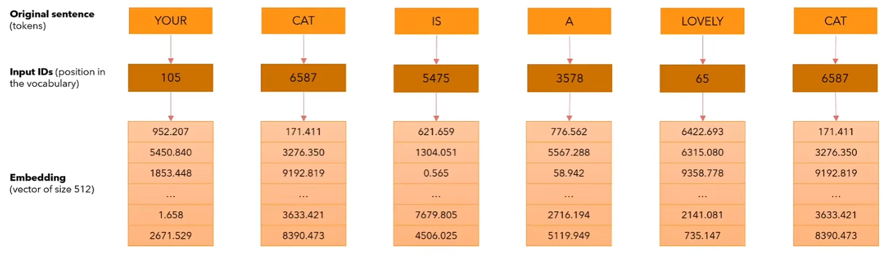

pytorch 为我们提供了一个 `nn.Embedding` 层，用于将输入的词表索引映射为对应的词向量表示。请注意，对于嵌入层的输出，存在一个小 trick：[乘以根号 d_model](https://ktv422gwig.feishu.cn/wiki/COSEwUT8CiJ7YvkCckHcVxREnfc?fromScene=spaceOverview#share-H8Fld90Spol3z3x73rfcdi1Vnyh)。
> 还使用预训练的嵌入（如 GloVe、Word2Vec）来初始化嵌入层，`nn.Embedding.from_pretrained` 方法可以加载预训练的嵌入。

### 2. positional encoding
> 位置编码层，用于将输入的句子中的单词位置信息编码到词向量中。详细信息请参见：[位置编码](https://ktv422gwig.feishu.cn/wiki/WUVBw8UX0iLP8Ck05AOcF0pSnve#share-IXV7dHxf5oeH7Bxe8cNczzcYnrf)

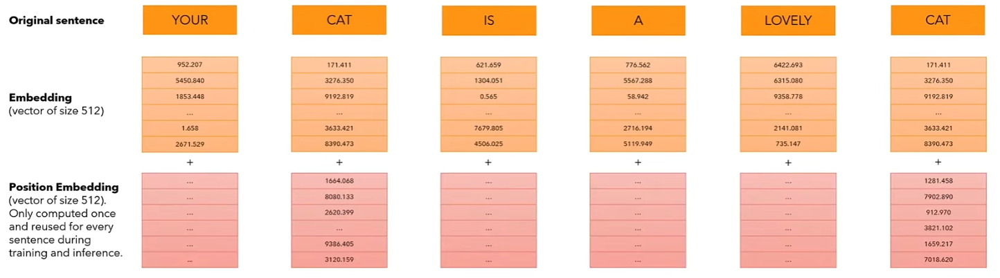

位置编码是一个形状为 (seq_len, d_model) 的矩阵，其中 seq_len 是句子的长度，d_model 是词向量的维度。

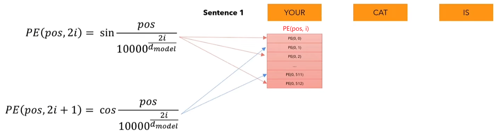

这里改进一下位置编码公式中的分母项：
```py
div_term = e^(2i * (-ln(10000)/d_model)) 
          = e^(-2i * ln(10000)/d_model)
          = (e^ln(10000))^(-2i/d_model)
          = 10000^(-2i/d_model)
```
这种形式的数学变换主要是为了<font color='red'>计算效率</font>和<font color='red'>数值稳定性</font>考虑，具体原因如下：
1. 数值稳定性：直接使用幂运算可能会导致数值上溢或下溢。当`d_model`较大时，`10000.0 ** (2*i / d_model)`得到的幂可能会变得非常小，以至于在数值计算中产生下溢。通过将其转换为指数和对数运算，可以避免这种情况，因为这样可以在计算过程中保持更好的数值范围
    > 下溢：`IEEE 754` 双精度浮点数（float32）最小正规范值约 `2.2e-308`，在半精度浮点数（float16）中，​​最小正数约为`5.96e-8`
2. 计算效率：在许多计算设备和库中，<font color='red'>指数和对数运算的实现通常比幂运算更快</font>。这主要是因为指数和对数运算在底层硬件和软件中有特定的优化实现，而幂运算通常需要计算更多的中间值。

关于位置编码中的广播：
```py
# 假设 seq_len=3, d_model=4 (实际d_model应为512等偶数)
position = [[0],  # shape (3,1)
            [1], 
            [2]]
div_term = [a, b]  # shape (2,)

# 逻辑扩展了之后，进行广播，相当于
position_expanded = [[0, 0],  # shape (3,2)
                    [1, 1],
                    [2, 2]] 
div_term_expanded = [[a, b],  # shape (3,2)
                    [a, b],
                    [a, b]]

# 逐元素相乘
result = [[0*a, 0*b],
        [1*a, 1*b], 
        [2*a, 2*b]]
```

### 3. LayerNorm
> 层归一化层，用于对输入进行归一化处理，以提高模型的训练效率和稳定性。

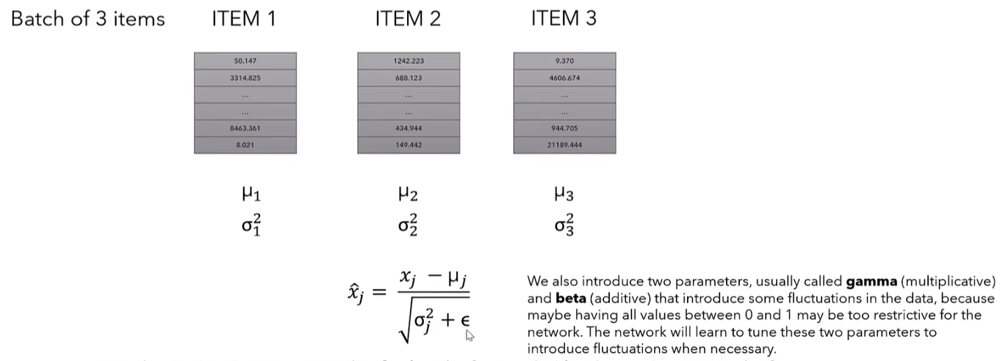
> `eps`: 防止方差除零（或者非常接近于 0，造成归一化后 ^x 的数值不稳定）的小常数，默认为 `1e-6`

`layerNorm` <font color='red'>对一个 `token` 的 `d_model=512` 维度的特征向量进行归一化</font>，求均值（`mean`）的过程如下（标准差`std`的求法也是类似的）：
```py
x = torch.tensor([[[1,2,3], 
                   [4,5,6]]])  # shape (1,2,3)
mean = x.mean(dim=-1, keepdim=True)
''''
tensor([[[2.],  # (1+2+3)/3
         [5.]]]) # (4+5+6)/3
'''
```
以下是一张关于 `LayerNorm` 的详细计算过程的图：
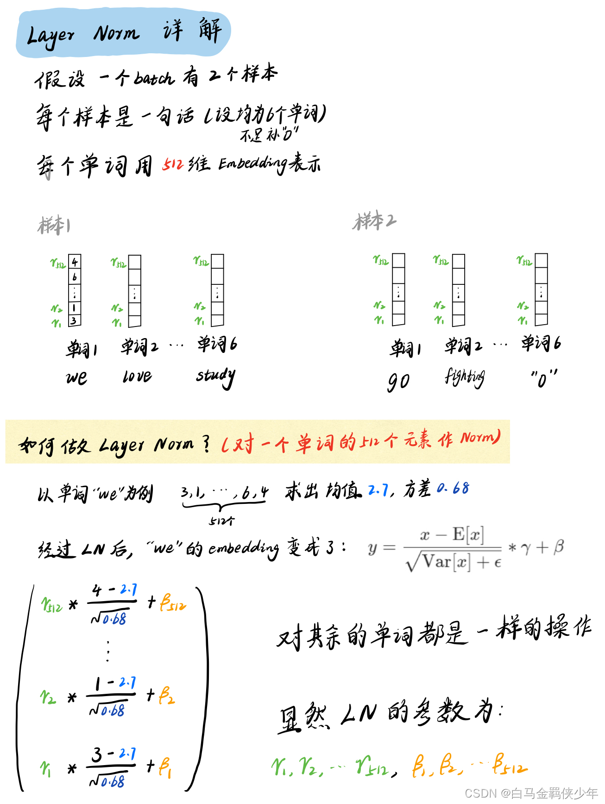

#### 3.1 缩放因子
- 当 `LayerNorm` 前向传播的输入形状为 `(batch_size, seq_len, 512)` 时
- 缩放因子 `alpha` 的形状是 (`512`)
- 每个特征维度（共`512`维）拥有独立的缩放参数
- 所有 `token` 共享同一套特征维度(`d_model=512`)的缩放参数

### 4. feedForward
> 逐位置的前向传播层，基本上就是两个全连接层，详情参见：[逐位置的前向传播层](https://ktv422gwig.feishu.cn/wiki/COSEwUT8CiJ7YvkCckHcVxREnfc?fromScene=spaceOverview#share-VD0FdjKl9oVAtjx0WkUc4kDAnCd)
1. 形状变化：`(batch_size, seq_len, d_model) -> (batch_size, seq_len, d_ff) -> (batch_size, seq_len, d_model)`
2. `linear` 线性层会默认在最后一个维度上做线性变换

### 5. MultiHeadAttention
> 多头注意力层，用于计算输入序列中不同位置之间的注意力权重。

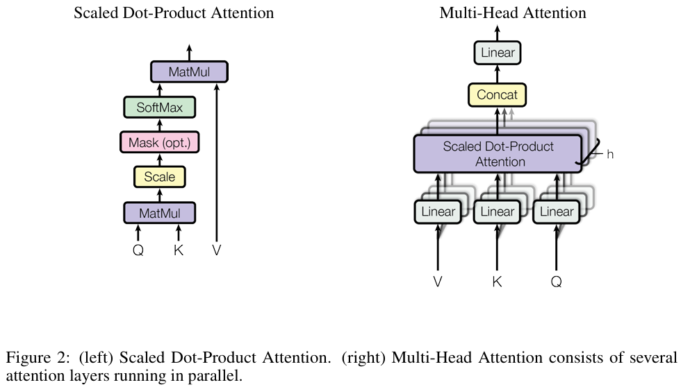

这里我们设计的非常巧妙：

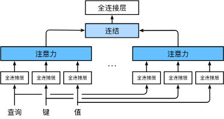
1. 我们并没有像上图一样，为每个头单独设计一个小的线性层进行变换，而是<font color='red'>将所有头合并为一个更大线性层，然后统一进行线性变换</font>，这样可以提高并行度。
2. 之后我们沿着嵌入维度而不是序列维度（因为所有头的变换结果都被放在了嵌入维度，也就是最后一个维度上）进行切分，这意味着一个头可以访问整个句子，只是句子中每个 `token` 的特征向量已经被切好了。
3. 之后我们对所有头根据 `Qi` 和 `Kj` 的点积进行 `softmax` 计算，得到注意力权重。然后对 `Vi` 进行加权求和，得到每个头的输出。
4. 最后，我们将所有头的输出进行拼接，对拼接结果再进行一次线性变换，即可得到最终的输出。

对应的流程图如下：
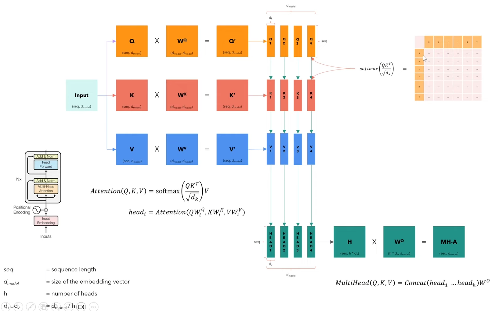
> 上图中，我们并没有展示批量维度。多头注意力的输入、输出维度保持一致。

#### 5.1 Mask
> 掩码，用于<font color='red'>解码器（其实编码器也需要，掩盖 \<pad> 的权重</font>在计算注意力权重时，将输入序列中的某些位置的注意力分数设置为一个极小值，这样在进行 `softmax` 时，这些位置注意力权重将会变为 `0`，从而实现对输入序列中某些位置的屏蔽。

**注意事项**
`pytorch` 中，我们可以按照下面的方式进行掩码：
```py
attention_scores.masked_fill_(mask == 0, -1e9)
```
但是我们需要注意：`masked_fill_` 和 `masked_fill` 的区别：
1. `masked_fill_` 是一个原地操作，会直接修改原始张量。
2. `masked_fill` 是一个非原地操作，会返回一个新的张量。

因此如果我们没有使用原地操作的话，一定要记得覆盖原来的`attention_scores`，否则掩码不会起作用。我们初始代码中就犯了这个错误，最后我们观察到<font color='red'>模型的预测序列中的所有 `token` 都相</font>同，这可能是因为掩码的确实导致掩码的注意力均匀分布，进而导致所有参数按照同一种方式进行更新，最终导致所有 `token` 都相同。


### 6. Residual Connection
> 残差连接，用于将输入和输出进行相加，以实现残差网络。

原始论文在残差主干网络上进行了残差 dropout
```py
# 原始论文是按照下面的顺序进行的
return self.norm(x + self.dropout(sublayer(x)))

# 但是很多实现都是按照下面的顺序进行的
return x + self.dropout(sublayer(self.norm(x)))
```

### 7. Encoder
> 编码器，用于对输入序列进行编码，并返回编码后的结果，编码器由 `N` 个相同的层堆叠而成（论文中`N=6`）。
* 注意事项：
1. 在 Transformer 原始论文中， 只有最后一个编码器块的输出 会被送到解码器的交叉注意力层；
2. 解码器的每一层在计算交叉注意力时都使用这同一份编码器输出；
3. 不是每个编码器层对应一个解码器层，编码器和解码器的层数可以不同；

#### 7.1 EncoderBlock
> 编码器块，用于对输入序列进行编码，并返回编码后的结果。

每个编码器块都包含两层：
1. 多头注意力层，用于计算输入序列中不同位置之间的注意力权重。
2. 前向传播层，用于计算输入序列中不同位置之间的特征向量。

每个编码器块都需要掩码：
1. 每个编码器块需要"独立"进行掩码操作（即每个块都要显式执行掩码计算）
2. 但使用的 mask 值是基于原始输入序列的 padding 位置生成的相同 mask
```plainText
输入序列: [A, B, <pad>, <pad>]
          │
          ▼
编码器块1:
  - A1: 聚合[A, B]信息（忽略<pad>）
  - B1: 聚合[A, B]信息（忽略<pad>）
  - P11: 聚合[A, B]信息（但输出被后续mask）
  - P12: 聚合[A, B]信息（但输出被后续mask）
          │
          ▼  
编码器块2:
  - A2: 仅聚合[A1, B1]信息（新mask忽略P11/P12）
  - B2: 仅聚合[A1, B1]信息（新mask忽略P11/P12） 
  - P21: 仅聚合[A1, B1]信息（新mask忽略P11/P12）
  - P22: 仅聚合[A1, B1]信息（新mask忽略P11/P12）
```

### 8. Decoder
> 解码器，用于对输入序列进行解码，并返回解码后的结果，解码器由 `N` 个相同的层堆叠而成（论文中`N=6`）。

在`Transformer`的解码器中， 训练阶段和推理阶段的工作方式不同 ：
1. 训练阶段 - 并行解码 ：<br><br>
   - 使用`teacher-forcing`方式，整个<font color='red'>目标序列并行处理</font>
   - 通过`mask`机制防止看到未来信息
   - 计算效率高，可以一次处理整个序列
2. 推理阶段 - 逐词解码 ：<br><br>
   - 自回归(`autoregressive`)生成，<font color='red'>每次只预测一个词</font>
   - 将已生成的词作为输入预测下一个词
   - 需要缓存之前的计算结果提高效率

#### 8.1 DecoderBlock
> 解码器块，用于对输入序列进行解码，并返回解码后的结果。

每个解码器块都包含三层：
1. 多头自注意力层；
2. 多头交叉注意力层；
3. 前向传播层。

以下是一个单头注意力层的流程图：
> 序列 hello 被拆分为了两个 token，嵌入层维度为 3，只有一个注意力头

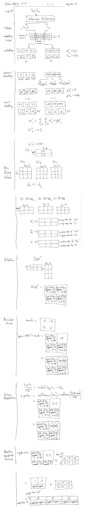

<font color='red'><b>注意事项</b></font>：
1. 第二个解码器块，没有直接和输入层连接。这并不意味着第一个子层不需要掩码，因为第二个解码器块的输入中靠后的` token` 已经从第一个解码器块中提取了整个输入层序列的信息，因此这里依旧需要掩码，防止前面的 `token` 看到后面 `token` 的信息，间接地提取了原序列的信息。<font color='blue'>同样的道理，所有解码器块的第一个子层都需要掩码。</font><br><br>
2. 但是解码器块的第二个交叉注意力子层不需要掩码，因为其 `Key、Value` 来自于编码器的输出，`Query` 来自解码器第一层的输出，编码器的整个序列的 `Value` 都是是可以被看到的。<br><br>
    > 这里可以这样理解，Value 不可能来自解码器，因为这里没有掩码，无法遮蔽后续解码器 Value 后续的信息。<br>
    <font color='red'>实际上第二个交叉注意力子层也需要掩码去屏蔽输入序列中的 `<pad>` 信息。</font>
3. 解码器的第一个自注意力子层处理目标序列内部关系（必须使用`mask`），第二个交叉注意力子层建立源语言与目标语言的对应关系（`Query` 来自解码器，`Key/Value`来自编码器），最后通过前馈网络进行特征变换和增强


### 9. Linear & Softmax
#### 9.1 Linear
> 线性层投影，用于将一个 token 的 d_model 维度的特征向量映射到 vocab_size 维度的特征向量，用于 softmax 计算，预测该词元的概率分布

#### 9.2 Softmax
> 用于计算每个词元的概率分布

首先回顾一下 `softmax` 的公式：$\text{softmax}(x_i) = \frac{e^{x_i}}{\sum_{j=1}^n e^{x_j}}$
* 上溢
    > 上溢：`IEEE 754` 双精度浮点数（`float32`）最大正规范值约 `1.79e+308`，在半精度浮点数（`float16`）中，​​最大正数约为`6.55e+4`

    <font color='red'><b>以下是 Pytorch 框架的默认 softmax 解决方法</b></font>：当 $x_i$ 非常大时，$e^{x_i}$ 可能会变得非常大，导致上溢。为了避免上溢，我们可以对 $x_i$ 进行归一化，即将 $x_i$ 减去 $\max_{j=1}^n x_j$，这样可以将 $x_i$ 的值缩放到一个较小的范围内。
    <br>改进之后的公式：$\text{softmax}(x_i) = \frac{e^{x_i - max}}{\sum_{j=1}^n e^{x_j - max}}$
    <br>等价性证明：$\frac{e^{x_i}}{\sum_j e^{x_j}} = \frac{e^{-max} \cdot e^{x_i}}{e^{-max} \cdot \sum_j e^{x_j}} = \frac{e^{x_i - max}}{\sum_j e^{x_j - max}}$
* 下溢
    > 下溢：`IEEE 754` 双精度浮点数（`float32`）最小正规范值约 `2.2e-308`，在半精度浮点数（`float16`）中，​​最小正数约为`5.96e-8`

    在 `pytorch` 默认进行规范化步骤防止 $softmax$ 上溢之后，我们发现 $x_j - max$ 可能会变得非常小，<font color='red'>进而指数运算</font> $e^{x_j - max} \to 0$， <font color='red'>导致计算得到的</font> $y_j = softmax(xj) \to 0$，<font color='red'>发生了下溢</font>，然后再使用 计算损失时会取对数，会得到 $log(softmax(xj))=log(0) = -\infty$。又发生上溢。<br>
    * $log\_softmax$
    因此我们不妨将取指数和取对数的操作直接合并在一起，指对操作相抵消，避免单独指数操作参数的下溢，这个操作就是 $log\_softmax$<br><br> $log\_softmax(xj) \\= \log\left(\frac{\exp(x_j)}{\sum_k \exp(x_k)}\right) \\= \log\left(\exp(x_j)\right) - \log\left(\sum_k \exp(x_k)\right) \\= x_j - \log\left(\sum_k \exp(x_k - \max(x))\right) - \max(x) \\ = (x_j - \max(x)) - \log\left(\sum_k \exp(x_k - \max(x))\right)$
    <br>因为第二个式子 `log` 中含有`Σ`，因此不能直接去 `exp`，为了保证数值稳定性，我们减去 `max(x)`（<font color='red'>这也是 `pytorch` 中 `log_softmax` 的默认操作</font>），而且我们不用担心下溢出，因为就算某一项 $x_j-max(x)$ 很小导致$e^{x_j-max(x)} \to 0$，多项相加之后$\log\left(\sum_k \exp(x_k - \max(x))\right)$ 内部不会趋于 0

#### 9.3 log_softmax + NLLLoss
因此我们使用 `log_softmax` 代替 `softmax`，解决了数值稳定性的问题，`log_softmax` 再配合 `NLLLoss` 损失，即可计算交叉熵损失。

$\text{NLLLoss}(x, y) = -\sum_{k=1}^C y_k x_k$
> 其中，$C$ 是类别数，$x_k$ 经过了 $log\_softmax$ 处理，$y_k$ 是真实标签的 one-hot 编码。
#### 9.4 CrossEntropyLoss
`CrossEntropyLoss` 是 `log_softmax` 和 `NLLLoss` 两个步骤的结合。我们只需要将网络未经过 `softmax` 的输出和真实标签的 one-hot 编码作为输入，即可通过单步交叉熵损失自动完成 `log_softmax` 分类和 `NLLLoss` 损失计算，同时也保证了数值稳定性。

$\text{CrossEntropyLoss(x, y)} = -\sum_{i=1}^C y_i \log(\frac{e^{x_i - max}}{\sum_{j=1}^n e^{x_j - max}})$
> 其中，$C$ 是类别数，$x_i$ 是模型的输出（未经过 softmax处理），$y_i$ 是真实标签的 one-hot 编码。


### 10. Encoder_Decoder
> 编码器-解码器架构，是 Transformer 架构的基础。

该架构主要包含以下的组件：
1. 编码器和解码器
encoder: Encoder,
decoder: Decoder,

2. 源、目标嵌入层
src_embed: InputEmbeddings,
tgt_embed: InputEmbeddings,

3. 源、目标位置编码层（可以共享）
src_pos: PositionalEncoding,
tgt_pos: PositionalEncoding,

4. 投影层
projection_layer: ProjectionLayer


### 参数初始化: Xavier

## 机器翻译
### Datasets
> [huggingface 数据集](https://huggingface.co/datasets)
* 下载：`conda install -c huggingface -c conda-forge datasets`
#### Opus Books
[Opus Books](https://huggingface.co/datasets/Helsinki-NLP/opus_books) 是一个机器翻译领域常用的平行语料数据集。从开放获取的电子书中提取的双语句对，涵盖多种语言对（如英-法、英-德等）。
- 包含文学类文本（小说、散文等）
- 句子结构较完整，语言规范
- 数据量通常在百万级句子对规模
#### Opus 100
[OPUS-100](https://huggingface.co/datasets/Helsinki-NLP/opus-100) 是一个以英语为中心的多语言语料库，涵盖 100 种语言。
OPUS-100 以英语为中心，这意味着所有训练对在源端或目标端都包含英语。语料库涵盖 100 种语言（包括英语）。 语言是根据 OPUS 中可用的并行数据量选择的。
OPUS-100 包含大约 55M 个句子对。在 99 个语言对中，44 个具有 1M 个句子对的训练数据，73 个至少有 100k，95 个至少有 10k。

### pathlib
> `pathlib.Path` 是一个用于处理文件路径的库，提供了一种统一的方式来访问文件和目录，并支持跨平台兼容性。

`Path("../tokenizers/tokenizer_en.json")` 返回的是一个 `pathlib.Path` 对象，而不是字符串。这个对象代表一个文件系统路径，提供面向对象的路径操作方法 ：
```py
p = Path("../tokenizers/tokenizer_en.json")
p.parent  # 获取父目录 Path('../tokenizers')
p.name    # 获取文件名 'tokenizer_en.json'
p.stem    # 获取主名 'tokenizer_en' 
str(p)  # 返回字符串形式的路径 '../tokenizers/tokenizer_en.json'
```

### 文本预处理
> 要求：`python≥3.9`
* 安装：pip install tokenizers
#### Tokenizer 
> Tokenizer 是一个完整的文本预处理工具链，在嵌入层之前使用。简单理解就是将句子分割为 token 并且索引化。
- 自动识别语言并应用相应分词规则
- 支持 `BPE/WordPiece/Unigram` 等分词算法<br><br>
    > 本项目将使用词级的 tokenizer，即 `WordPiece` 分词器。也就是直接通过句子间的空格将句子分割为 token，然后每个 token 映射到一个数值索引。
- 自动添加`[CLS]、[SEP]、[PAD]`等特殊标记，处理未知词(`[UNK]`)和掩码(`[MASK]`)
- 自动生成 `attention_mask` 区分真实 `token` 和 `padding`
#### ShiftRight
> 直接使用未右移的目标序列（tgt）作为解码器输入，导致模型在预测第 tgt 个位置时可能提前看到当前待预测的标签（信息泄漏），迫使开发者通过掩码对角线设为 -inf 来强行掩盖（临时方案但逻辑错误）

使用 `shiftRight` 配合合适的掩码矩阵，才能避免信息泄露，参考：[shiftRight](https://ai.stackexchange.com/questions/25483/transformers-how-to-use-the-target-mask-properly)
#### Dataset
> 使用 `Tokenizer` 构建词表之后，再利用它将原始句子转化为索引序列，之后再添加 `<SOS>` 和 `<EOS>`、`<PAD>` 等标记，构建 `Dataset`。


### 训练、验证和测试
#### 训练
> 在训练阶段，`Transformer` 不是完全自回归的 ，但使用了类似自回归的机制。使用 `teacher-forcing` 方式，一次性输入整个目标序列，通过右移和掩码模拟自回归行为
- 使用 <font color='red'>真实的目标序列</font> 作为解码器输入（称为`"teacher forcing"`）
- 但会将目标序列 右移一位 （添加 [SOS] 开头，去掉最后一个token）
- 这样做的目的是让模型在预测第 `t` 个`token`时，只能看到前`t-1`个<font color='red'>真实</font>`token`
##### teacher-forcing
> 参考文献：[Teacher Forcing](https://zhuanlan.zhihu.com/p/93030328)

教师强制（`Teacher Forcing`）是训练序列生成模型时广泛采用的核心策略，与`Autoregressive`模式相对应:
> 如果要用比较不太严谨的比喻来说，Teacher-Forcing 技术相当于就是小明学习的时候旁边坐了一位学霸，当发现小明在做序列生成题目的时候， 每一步都把上一步的正确答案给他偷看。那么小明当然只需要顺着上一步的答案的思路，计算出这一步的结果就行了。这种做法，比起自己每一步都瞎猜， 当然能够<font color='red'>有效的避免误差进一步放大</font>，同时在学习前期还能<font color='red'>通过学霸辅导的这种方式快速学到很多的知识</font>。

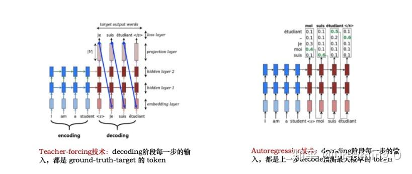
`Teacher-Forcing` 技术之所以作为一种有用的训练技巧，主要是因为：
1. 高效并行计算（核心原因）
    `Teacher-Forcing` 技术是保证 `Transformer` 模型能够在训练过程中完全并行计算所有`token`的关键技术。
    由于`Teacher-Forcing`使用上一时刻的真实标签作为输入，而一开始我们其实就可以拿到这个句子的真实标签，因此我们不必等待自回归预测，直接使用真实标签并行预测所有时间步的输出。
2. 收敛速度提高
    `Teacher-Forcing` 能够极大的加快模型的收敛速度，令模型训练过程更加快&平稳。
3. 避免误差累计
    `Teacher-Forcing` 能够在训练的时候矫正模型的预测，避免在序列生成的过程中误差进一步放大。
###### Exposure Bias
`Teacher Forcing` 最常见的问题就是 `Exposure Bias` 了。在严肃开始介绍这个问题的时候，我们继续下上面不太严谨的比喻：
> 由于小明平常的学习都是由超级学霸指导下完成的。但是在真正考试的时候，这种情况平常根本没出现过。没有了超级学霸在旁边，心态容易崩，答案写起来起来也感觉容易崩，才发现自己原来一直学习在学霸的阴影下，从没真正的学习过自己的错误。

上面的『比喻』，其实就是不太严谨的 `Exposure Bias` 现象了。更严谨的表述，由于训练和预测的时候`decode`行为的不一致， 导致预测单词（`predict words`）在训练和预测的时候是从不同的分布中推断出来的。而这种不一致导致训练模型和预测模型直接的`Gap`，就叫做 `Exposure Bias`。

除了常见的 `Exposure Bias` 问题之外，今年的`ACL2019` 最佳`paper`中还指出好几个存在的问题：

1. `Teacher-Forcing` 技术在解码的时候生成的字符都受到了 `Ground-Truth` 的约束，希望模型生成的结果都必须和参考句一一对应。这种约束在训练过程中减少模型发散，加快收敛速度。但是一方面也扼杀了翻译多样性的可能。
2. `Teacher-Forcing` 技术在这种约束下，还会导致一种叫做 `Overcorrect`(矫枉过正) 的问题。例如：
    > 1. 待生成句的`Reference`为: `"We should comply with the rule."`
    > 2. 模型在解码阶段中途预测出来：`"We should abide"`
    > 3. 然而`Teacher-forcing`技术把第三个`ground-truth "comply"`作为第四步的输入。那么模型根据以往学习的`pattern`，有可能在第四步预测到的是 `"comply with"`
    > 4. 模型最终的生成变成了 `"We should abide with"`
    > 5. 事实上，`"abide with"` 用法是不正确的，但是由于`ground-truth "comply"` 的干扰，模型处于矫枉过正的状态，生成了不通顺的语句。

在学术届中，其实早就意识到 `Teacher-Forcing` 所带来的问题，今年的`ACL2019 Best-Paper`，也是主要建立在如何解决翻译问题上的`teachering-forcing`问题。在这里我分享个人认为比较有价值的三篇论文。不做详细解读，仅对其核心思路进行阐述。
> 详情请参见：[ACL2019 Best-Paper](https://zhuanlan.zhihu.com/p/93030328)
##### 学习率调整
使用大 batch_size 时，可以使用大一点的学习率，因为大 batch_size 对应的样本分布更加稳定，样本梯度方差较小，此时小批量上的梯度方向更能反映整体数据的梯度方向，因此可以使用大的学习率。
使用小 batch_size 时，可以使用小一点的学习率，因为小 batch_size 对应的样本分布更加不稳定，样本梯度方差较大，此时小批量上的梯度方向可能会受到个别样本的影响，无法反映整个数据分布的梯度方向，因此可以使用小的学习率。
#### 验证 & 测试
> 推理时需要采用自回归的方式，每次只预测一个词元，然后将预测的词元作为输入，继续预测下一个词元，直到生成结束标记。
- 使用 <font color='red'>模型自己预测的序列</font> 作为解码器输入
- 从 [SOS] 开始，逐步预测每个 `token`
- 每次预测一个 `token` 后，将其添加到输入序列中用于预测下一个 `token`
- <font color='red'>直到预测出 [EOS] 或达到最大长度</font>，停止预测
##### 输入序列的长度
另外一个注意事项是编码器/解码器的输入长度，我们之前好像一直将编/解码器的输入长度限制为 `seq_len`（即预设的最大序列长度）是为了构建小批量进行并行计算。

但是<font color='red'>输入长度在理论上是没有限制的</font>，这就是注意力机制的天然优势。也是我们后续贪婪解码的基础。

我们可能存在一个疑问，预测时我们使用自回归生成的方式，不添加 \<pad>，而是使用真正的预测序列的长度，这样不会导致模型训练，预测时的行为不一致，导致模型性能降低吗？
> 其实真正训练和预测时的行为不一致，主要在于 `teacher-forcing` 和 `Autoregressive` 的区别。

我们可以从以下两个方面来解释这个疑问：
* 模型的结构<br><br>
    - 位置编码：三角函数位置编码因为其周期、有界的特性，可以泛化到任意长度
    - 注意力掩码 ：动态生成的因果掩码适配不同长度
    - 自注意力层：通过注意力机制，模型可以学习到输入序列中不同位置之间的依赖关系，不受序列长度的限制
    - 层归一化 ：对变长输入具有适应性
* 模型的泛化性能<br><br>
    > 训练时，我们看似固定了序列长度，但是模型在训练时已经通过以下方式学会了处理变长序列，增强泛化性：
    - 对于 \<pad> 填充词等特殊标记词元，它被自注意力层提取的信息已经被掩码遮蔽
    - 计算损失时，我们并没有计算 \<pad> 的损失，但是计算了 <EOS> 的损失（解码器的 label 中含有 \<EOS> 和 \<pad>，但是只计算了 \<EOS> 的损失，因为解码器需要预测结束位置）

    也就是说，填充的 \<pad> 实际上没有对模型的训练产生实质性的影响，模型实际上处理的就是变长序列。
    <br>另外，模型在学习一个长句子的时候，解码器通过 `casual mask` 的结构实际上也在学习它的所有子句子。这也增强了模型对不同长度序列的泛化性。

##### 贪婪解码
> 贪婪解码(`Greedy Decoding`)是`Transformer`等自回归模型在推理阶段常用的一种序列生成策略。它的核心思想是： 在每一步解码时，都会检查当前长度是否超过`max_len`，动态生成因果掩码(`causal_mask`)来适配当前长度，而且都选择当前概率最高的词元作为输出 ，直到生成结束标记或达到最大长度。

- 单步最优选择 ：<br>
    - 每一步都选择当前概率最大的token
    - 不考虑全局最优序列<br><br>
- 实现简单高效 ：<br>
    - 只需维护一个不断增长的输出序列
    - 计算复杂度低<br><br>
- 自回归特性 ：<br>
    - 将上一步的输出作为下一步的输入
    - 逐步构建完整序列<br>


##### 束搜索
> 我们刚刚提到，贪婪解码基于贪心策略，每一步解码只关系局部最优，无法保证全局最优。为了提高预测精度，我们可以使用束搜索的方法，详情参见：[Beam Search](https://ktv422gwig.feishu.cn/wiki/WUVBw8UX0iLP8Ck05AOcF0pSnve#share-BE8udbZjco4OBBxMH1kczKbUnMg)
#### 注意事项
> 之前提到：“在推理时，每次预测一个 `token` 后，将其添加到输入序列中用于预测下一个 `token`”<br>

有没有这样一种可能？那就是将预测的 `token` 添加到解码器输入去预测下一个 `token` 的时候，上一个 `token` 的预测值发生了改变？<br>
答案是不会，一旦某个`token`被预测并添加到输入序列中，后续解码不会改变之前的预测。关键保证如下：
- 解码器的自注意力机制会使用因果掩码(`causal mask`)，确保每个位置只能看到之前的位置
- 模型参数在推理过程中是固定的（不更新权重）<br>

综合以上两个条件，就算新预测的 `token t` （第 `t` 位置）被加入了解码器输入，那么下一次解码器在预测第 `t` 位置的时候，依旧只能看到`t` 之前的位置，预测结果不会发生变化。


### 评价指标

### 权重可视化